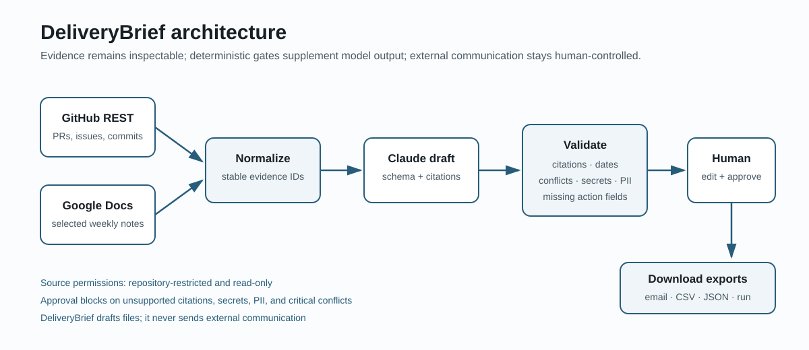

# DeliveryBrief

DeliveryBrief helps a project or delivery manager turn GitHub activity and project notes into a client email and an internal action list. Every factual item links back to evidence, and the manager must review the result before approval.

[Source repository](https://github.com/BigVeezus/deliverybrief) · [Live demo](https://deliverybrief.streamlit.app/)

The name is deliberately plain. **Delivery** names the manager's responsibility. **Brief** describes the short output. I left AI out of the product name because the user needs a dependable weekly report, not another AI interface.

## Try the sample workflow

1. Install Python 3.12 or newer and run `pip install -e ".[dev]"`.
2. Copy `.env.example` to `.env`; leave `DELIVERYBRIEF_MODE=demo` for the included sample.
3. Run `streamlit run app.py` and open the displayed URL.

The same workflow is available as `make install`, `make check`, and `make run`.

Demo mode requires no private credentials. It uses labeled sample evidence and a deterministic generator so reviewers can exercise collection, validation, editing, approval, and export. Live mode uses the same domain objects and activates GitHub, Google Docs, and Claude through environment variables.

## What the manager does

1. Choose a week and collect evidence.
2. Inspect the GitHub and project-note records.
3. Generate a draft.
4. Review citations and warnings.
5. Edit and approve the report.
6. Download the client email, action CSV, JSON record, and run summary.

The application never sends email or changes GitHub or Google Drive.

## Architecture



```text
GitHub REST API ----\
                     > Evidence records -> Report generation -> Validation
Google Docs API ----/                                      -> Human review
                                                               -> Exports
```

The live adapters are read-only. Claude receives normalized evidence with stable IDs and returns a structured report. Deterministic checks then verify that cited IDs exist, dates are plausible, action fields are complete, and client text does not contain common secret or personal-data patterns.

## Configuration

Set `DELIVERYBRIEF_MODE=live` and provide:

- `ANTHROPIC_API_KEY`
- `GITHUB_TOKEN` with read-only access to the configured repository
- `GITHUB_REPOSITORY` in `owner/repository` form
- `GOOGLE_SERVICE_ACCOUNT_JSON`, either inline JSON or a path to the JSON file
- `GOOGLE_DRIVE_FOLDER_ID` shared with the service account as Viewer
- `DELIVERYBRIEF_REPOSITORY_URL` set to the public source repository before deployment

The model names are configuration rather than code constants. This keeps the evaluation reproducible if account access differs from the default model names.

## Evaluation

Run:

```bash
python -m deliverybrief.evaluation --dataset evaluation/cases --model primary --estimate-only
python -m deliverybrief.evaluation --dataset evaluation/cases --model primary --max-estimated-cost-usd 0.30
```

The repository contains ten labeled cases, expected behavior, deterministic checks, and an output location for measured results. The latest capped Haiku run passed 9 of 9 scored report cases; the transient API case is covered by an automated integration test. The nine paid cases cost an estimated $0.025316. See `docs/evaluation-package.md` for the method and `docs/evidence-needed.md` for the remaining evidence checklist.

## Important limits

- Demo evidence is illustrative, not proof of a real user's time savings.
- Secret and PII checks are deliberately conservative patterns, not a data-loss-prevention product.
- Contradiction detection combines explicit source markers and model output; it cannot settle an ambiguous delivery decision.
- SQLite is sufficient for this five-day, single-project scope. It is not a multi-tenant audit store.
- The manager remains responsible for the external message.

## Documentation

- [Decision record](docs/decisions.md)
- [Operator runbook](docs/runbook.md)
- [Evaluation package source](docs/evaluation-package.md)
- [Case study source](docs/case-study.md)
- [AI collaboration note](docs/ai-collaboration-note.md)
- [User interview guide](docs/user-interview.md)
- [Five-minute demo script](docs/demo-script.md)
- [Quest control sheet](docs/quest-control.md)
- [Deadline confirmation email](docs/deadline-confirmation-email.md)
- [Evaluation Package PDF](output/pdf/DeliveryBrief-Evaluation-Package.pdf)
- [Case Study PDF](output/pdf/DeliveryBrief-Case-Study.pdf)
- [AI Collaboration Note PDF](output/pdf/DeliveryBrief-AI-Collaboration-Note.pdf)
